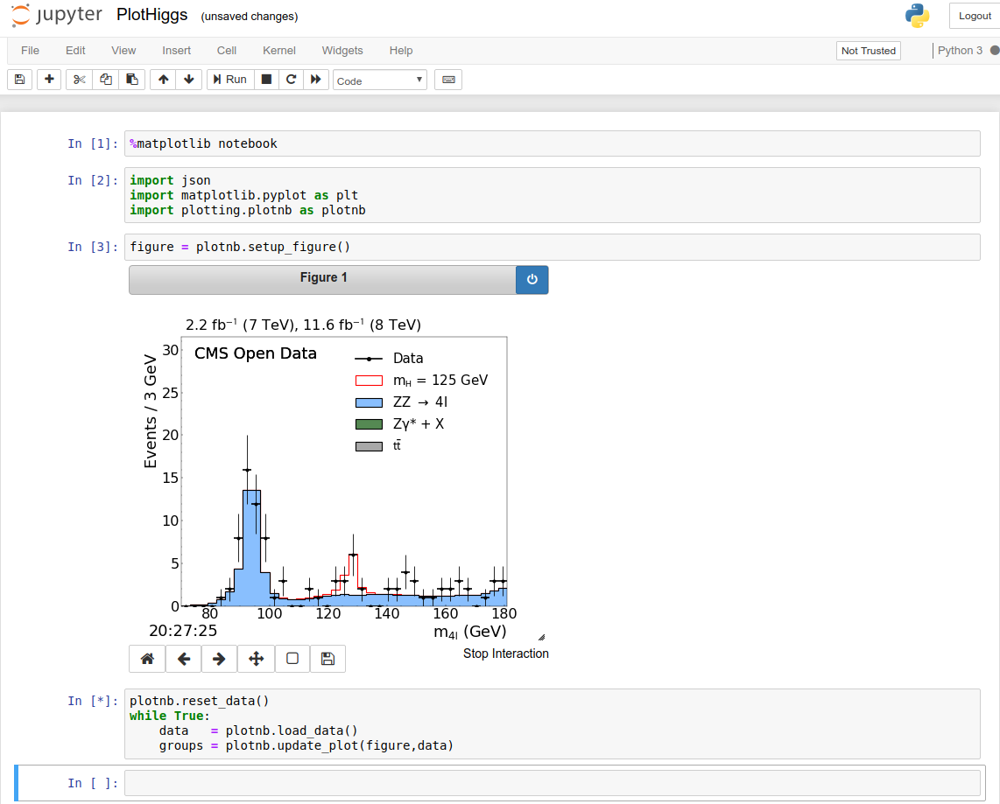

# Rediscovering the Higgs boson using the Google Cloud Platform

This tutorial shows you how to replicate on Google Cloud Platform (GCP) a small
end-to-end slice of the analysis that was used to discover the Higgs boson
particle. The tutorial uses Kubernetes clusters to emulate the distributed
nature of the original analysis.

This tutorial is intended for []. It assumes that you're familiar with
Terraform, Kubernetes, Redis, and Jupyter notebooks, and it assumes you're
generally familiar with GCP.

[TOC]

## Introduction

On 4 July 2012, Researchers at the European Organization for Nuclear Research (CERN)
[announced](https://cms.cern/physics/higgs-boson/observation-new-particle-mass-125-gev)
that they had recorded events in the ATLAS and CMS experiments at the Large
Hadron Collider (LHC) that had properties consistent with a new particle, the
Higgs boson.

Some particles such as the Higgs boson are so hard to detect that the problem
has to be approached indirectly.  Information about the Higgs boson can be
inferred by looking at the shower of particle interactions from a collision in
the LHC. Researchers try to determine how many of the interactions seen can
happen with or without a Higgs boson present.

At CERN, to detect particles that the Higgs boson decays into, researchers
compared the shower of decay events
([decay channels](https://cms.cern/physics/higgs-boson-terms-and-definitions))
that they expected to see through non-Higgs-related (that is,
[Background](https://cms.cern/physics/higgs-boson-terms-and-definitions))
processes with the actual events measured in the detectors. The corresponding
analysis required compute hardware spread across datacenters around the world,
with significant human coordination across the sites. It was a massive effort
that required a lot of people, compute resources, and storage resources.

In this tutorial, you perform a version of the same 
[analysis](https://cms.cern/physics/higgs-boson/observation-new-particle-mass-125-gev)
that the researchers used. You run jobs that compare simulations of background
events/processes to actual observed data from detectors. If the observed data
contains a
[statistical excess](https://cms.cern/physics/higgs-boson-terms-and-definitions)
of any of these particular decay channels, it indicates the presence of a new
particle, namely the Higgs boson.

For this tutorial, you create a small cluster and pull only a small slice of
the data. This enables you to work through the end-to-end analysis while
keeping costs down.


## Architecture

The following diagram illustrates the architecture that you create in this
tutorial.


The data is derived from CERN Open Data and is stored in a Cloud Storage
bucket. Google Kubernetes Engine (GKE) provides the core infrastructure you’ll
use to run analysis jobs

You manage cloud infrastructure resources for this tutorial using Terraform,
which is already installed and configured in GCP. This helps simplify the steps
for the tutorial, and promotes best practices when working in the cloud.


## Costs

This tutorial uses billable components of Google Cloud Platform, including:

- Kubernetes Engine
- Container Registry
- Cloud Storage

You can use the
[Pricing Calculator](https://cloud.google.com/products/calculator)
to generate a cost estimate based on your projected usage.


## Objectives

- Create a Kubernetes cluster
- Run a Jupyter notebook that emulates the analysis work
- Cache data using Redis


## Before you begin

1. Select or create a GCP project.

    GO TO THE MANAGE RESOURCES PAGE

2. Enable billing for your project.

    ENABLE BILLING

3. Enable the Kubernetes Engine (GKE) API:

    Enable the GKE API


## Initialize the environment

1. Open Cloud Shell.

[Launch Cloud Shell](https://console.cloud.google.com/?cloudshell=true)

2. Make sure the project you just created is selected:

    screenshot of cloud console project selection [Editor: please help]

3. Verify that current Cloud Shell project is the one you just created:

    echo $GOOGLE_CLOUD_PROJECT

You run all the commands in this tutorial from this Cloud Shell window.


## Downloading the code

1. In Cloud Shell, clone the tutorial repository:

    git clone https://github.com/mmm/higgs-tutorial


## Create a Kubernetes cluster

1. Go to the subdirectory that contains the configuration information for
   Terraform:

    cd higgs-tutorial/terraform/gke-cluster

2. Create the cluster.  As noted earlier, this task is handled by running
   Terraform commands.

    terraform init
    terraform plan
    terraform apply

   It takes a few minutes for the Kubernetes nodes to start.


3. When the cluster is running, get credentials for the new cluster:

    gcloud container clusters get-credentials higgs-tutorial --region us-central1

   For this tutorial, you use `us-central1` as the region.


## Deploying Jupyter and Redis

The next task is to create the basic framework of tools that are needed before any job runs
are kicked off.

1. Go to the subdirectory that contains the configuration information for the tools:

    cd ../prep

2. Install the tools:

    terraform init
    terraform plan
    terraform apply

   This set of commands starts a Redis cache, a Jupyter notebook server, and a Kubernetes
   DaemonSet to pre-pull all the docker images that are needed for analysis.

3. When the `terraform apply` command has finished, copy the Jupyter URL that's
   displayed and go to that URL in a new browser window. Later you visualize
   the results of the analysis in this window.


## Starting the Kubernetes jobs

1. In Cloud Shell, go to the subdirectory where the jobs are defined:

    cd ../jobs

2. Start the analysis jobs

    terraform init
    terraform plan
    terraform apply

   These commands load a separate kubernetes job for each datafile in the
   dataset.


## Visualize results

You can visualize results in a Jupyter notebook as the jobs run.

1. In the browser window that you opened earlier, click to open the
   `PlotHiggs.ipynb` notebook.

2. Click through and execute all cells in the notebook to make sure everything
   is running.

   The default behavior in this notebook is to render a graph of test data,
   _not_ of the data coming directly from the jobs. This test data plot is what
   you would see if you ran the 26,000 core cluster against the _full_ 74TB
   dataset used on stage.




## Store the results

After you've verified that your notebook runs, you can use the Redis cache
to store the outputs of your job runs.

1. Open the Jupyter notebook.

2. Find the cell that contains the main plot loop:

```python
plotnb.reset_data()
while True:
    data   = plotnb.load_data()
    groups = plotnb.update_plot(figure,data)
```

3. Change the method that loads data (`load_data`) to get the data from the
   Redis cache instead of the default test dataset:

```python
plotnb.reset_data()
while True:
    data   = plotnb.load_data('redis:data')
    groups = plotnb.update_plot(figure,data)
```

When you re-execute that cell you'll see a plot of the data just processed on
your tutorial-sized cluster.


## Cleaning up

To avoid incurring charges to your Google Cloud Platform account for the
resources used in this tutorial:

### Delete the project using the GCP Cloud Console

The easiest way to clean up all of the resources used in this tutorial is
to delete the project that you initially created for the tutorial.

Caution: Deleting a project has the following effects:
- Everything in the project is deleted. If you used an existing project for
  this tutorial, when you delete it, you also delete any other work you've done
  in the project.
- Custom project IDs are lost. When you created this project, you might have
  created a custom project ID that you want to use in the future. To preserve
  the URLs that use the project ID, such as an appspot.com URL, delete selected
  resources inside the project instead of deleting the whole project.

1. In the GCP Console, go to the Projects page.

    GO TO THE PROJECTS PAGE

2. In the project list, select the project you want to delete and click Delete
   delete.
3. In the dialog, type the project ID, and then click Shut down to delete the
   project.

### Deleting resources using Terraform

If you added the tutorial resources to an existing project, you
can clean up those resources using Terraform.

1. In Cloud Shell, remove the jobs:

    cd jobs
    terraform destroy

2. Remove the Jupyter and Redis servers:

    cd ../prep
    terraform destroy

3. Remove the GKE Cluster:

    cd ../gke-cluster
    terraform destroy


## What's next

- You can dig further into
  [Physics at CERN](https://home.cern/science/physics).

- Learn more about
  [Cloud](https://cloud.google.com/),
  [Kubernetes](https://cloud.google.com/kubernetes),
  High Performance Computing (HPC) on GCP
  [reference architectures](https://cloud.google.com/solutions/hpc/) and 
  [posts](https://cloud.google.com/blog/topics/hpc).

- Learn more about
  [CERN software](https://ep-dep-sft.web.cern.ch).

- Learn more about the detectors used in experiments at CERN
  like [CMS](https://home.cern/science/experiments/cms),
  [ATLAS](https://home.cern/science/experiments/atlas),
  and [other experiments](https://home.cern/science/experiments).

